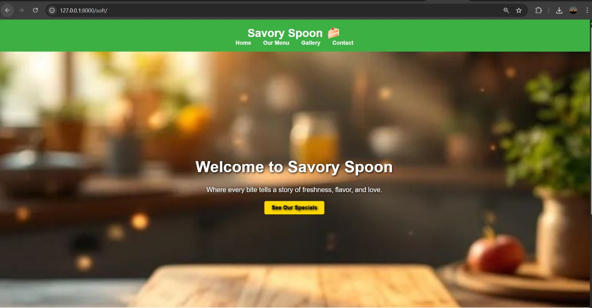
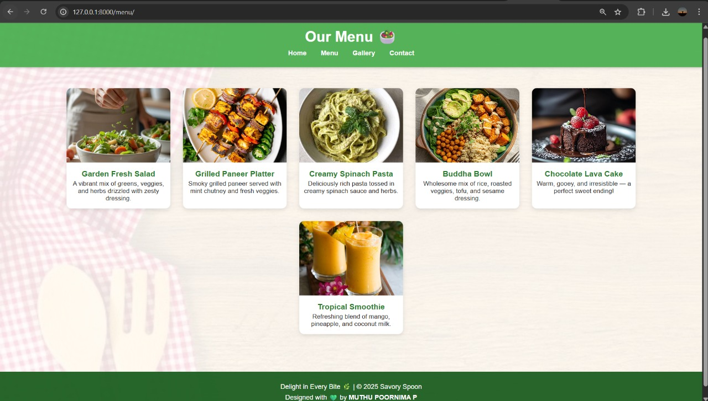
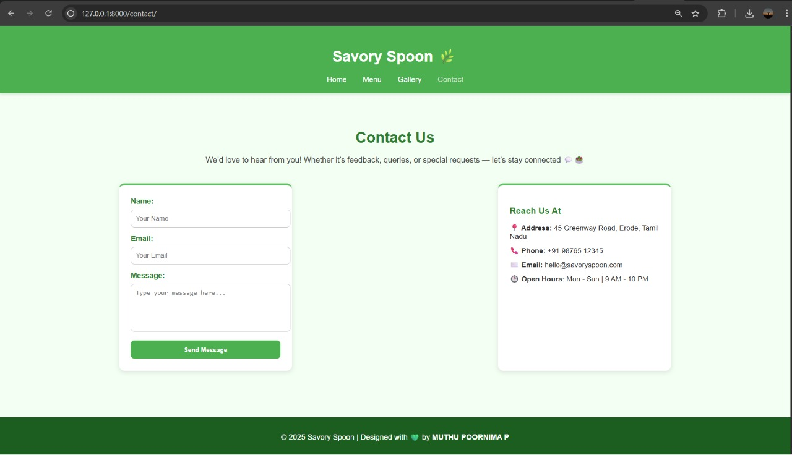

# Ex.07 Restuarant Website
## Date:04-11-2025

## AIM:
To develop a static Resturant website to display the menu and services provided by the resturant.

## DESIGN STEPS:

### Step 1:
Requirement collection.

### Step 2:
Creating the layout using HTML and CSS.

### Step 3:
Updating the sample content.

### Step 4:
Choose the appropriate style and color scheme.

### Step 5:
Validate the layout in various browsers.

### Step 6:
Validate the HTML code.

### Step 7:
Publish the website in the given URL.

## PROGRAM:
soft.html
```

<!DOCTYPE html>
<html lang="en">
<head>
  <meta charset="UTF-8">
  <meta name="viewport" content="width=device-width, initial-scale=1.0">
  <title>Savory Spoon</title>

  <style>
    body {
      font-family: Arial, sans-serif;
      margin: 0;
      padding: 0;
      color: white;
    }

    header {
      background-color: #3cb043;
      text-align: center;
      padding: 15px 0;
    }

    header h1 {
      margin: 0;
    }

    nav a {
      text-decoration: none;
      color: white;
      margin: 0 15px;
      font-weight: bold;
    }

    nav a:hover {
      text-decoration: underline;
    }

    /* ✅ Background image section */
    .hero {
      background-image: url("");
      background-size: cover;
      background-position: center;
      background-repeat: no-repeat;
      height: 80vh;
      display: flex;
      flex-direction: column;
      align-items: center;
      justify-content: center;
      text-align: center;
      color: white;
      text-shadow: 2px 2px 6px black;
    }

    .hero h2 {
      font-size: 2.8em;
      margin-bottom: 10px;
    }

    .hero p {
      font-size: 1.2em;
      margin-bottom: 20px;
    }

    .btn {
      background-color: #FFD700;
      color: black;
      padding: 10px 20px;
      text-decoration: none;
      border-radius: 5px;
      font-weight: bold;
    }

    .intro {
      background-color: #f8fff8;
      color: #222;
      padding: 40px 20px;
      text-align: center;
    }

    .intro h2 {
      color: #1d8a32;
    }

    .intro img {
      margin-top: 20px;
      width: 300px;
      border-radius: 10px;
    }

    footer {
      background-color: #222;
      text-align: center;
      padding: 10px;
      color: #ccc;
    }
  </style>
</head>

<body>

  <!-- Header -->
  <header>
    <h1>Savory Spoon 🍰</h1>
    <nav>
      <a href="index.html">Home</a>
      <a href="menu.html">Our Menu</a>
      <a href="gallery.html">Gallery</a>
      <a href="contact.html">Contact</a>
    </nav>
  </header>

  <!-- Hero Section with Background Image -->
  <section class="hero">
    <h2>Welcome to Savory Spoon</h2>
    <p>Where every bite tells a story of freshness, flavor, and love.</p>
    <a href="menu.html" class="btn">See Our Specials</a>
  </section>

  <!-- About Section -->
  <section class="intro">
    <h2>What Makes Us Special?</h2>
    <p>
      At Savory Spoon, we believe food is an experience — not just a meal. From our garden-fresh salads 
      to sizzling sizzlers and homemade desserts, every dish is crafted with care to make you smile with every bite.
    </p>
    
  </section>

  <!-- Footer -->
  <footer>
    <p>© 2025 Savory Spoon | Designed with 💚 by <strong>Muthu Poornima P</strong></p>
  </footer>

</body>
</html>

```

menu.html

```

<!DOCTYPE html>
<html lang="en">
<head>
  <meta charset="UTF-8">
  <meta name="viewport" content="width=device-width, initial-scale=1.0">
  <title>Menu | Savory Spoon</title>

  <style>
    body {
      margin: 0;
      font-family: 'Poppins', sans-serif;
      color: #2c2c2c;
      /* ✅ Background image setup */
      background-image: url("");
      background-size: cover;
      background-position: center;
      background-attachment: fixed;
      background-repeat: no-repeat;
    }

    /* Add a semi-transparent overlay for readability */
    .overlay {
      background-color: rgba(255, 255, 255, 0.88);
      min-height: 100vh;
    }

    header {
      background: rgba(76, 175, 80, 0.95);
      color: white;
      text-align: center;
      padding: 1.5rem 0;
      box-shadow: 0 2px 6px rgba(0,0,0,0.2);
    }

    nav {
      margin-top: 10px;
    }

    nav a {
      color: white;
      margin: 0 15px;
      text-decoration: none;
      font-weight: bold;
      transition: 0.3s;
    }

    nav a:hover {
      color: #ffe082;
    }

    h1 {
      margin: 0;
      font-size: 2.2em;
    }

    .menu {
      display: flex;
      flex-wrap: wrap;
      justify-content: center;
      gap: 30px;
      padding: 50px 20px;
    }

    .dish {
      background: white;
      border-radius: 12px;
      box-shadow: 0 4px 10px rgba(0,0,0,0.1);
      width: 250px;
      text-align: center;
      transition: transform 0.3s ease, box-shadow 0.3s ease;
    }

    .dish:hover {
      transform: scale(1.05);
      box-shadow: 0 6px 14px rgba(0,0,0,0.15);
    }

    .dish img {
      width: 100%;
      border-radius: 12px 12px 0 0;
      height: 180px;
      object-fit: cover;
    }

    .dish h3 {
      margin: 12px 0 5px 0;
      color: #2e7d32;
    }

    .dish p {
      margin: 0 10px 15px;
      font-size: 0.95em;
    }

    footer {
      background: rgba(27, 94, 32, 0.95);
      color: white;
      text-align: center;
      padding: 20px;
      margin-top: 40px;
    }

    footer p {
      margin: 5px;
    }
  </style>
</head>

<body>
  <div class="overlay">
    <!-- Header Section -->
    <header>
      <h1>Our Menu 🥗</h1>
      <nav>
        <a href="index.html">Home</a>
        <a href="menu.html">Menu</a>
        <a href="gallery.html">Gallery</a>
        <a href="contact.html">Contact</a>
      </nav>
    </header>

    <!-- Menu Section -->
    <section class="menu">
      <div class="dish">
        
        <h3>Garden Fresh Salad</h3>
        <p>A vibrant mix of greens, veggies, and herbs drizzled with zesty dressing.</p>
      </div>

      <div class="dish">
        
        <h3>Grilled Paneer Platter</h3>
        <p>Smoky grilled paneer served with mint chutney and fresh veggies.</p>
      </div>

      <div class="dish">
        
        <h3>Creamy Spinach Pasta</h3>
        <p>Deliciously rich pasta tossed in creamy spinach sauce and herbs.</p>
      </div>

      <div class="dish">
        
        <h3>Buddha Bowl</h3>
        <p>Wholesome mix of rice, roasted veggies, tofu, and sesame dressing.</p>
      </div>

      <div class="dish">
        
        <h3>Chocolate Lava Cake</h3>
        <p>Warm, gooey, and irresistible — a perfect sweet ending!</p>
      </div>

      <div class="dish">
        
        <h3>Tropical Smoothie</h3>
        <p>Refreshing blend of mango, pineapple, and coconut milk.</p>
      </div>
    </section>

    <!-- Footer -->
    <footer>
      <p>Delight in Every Bite 🌿 | © 2025 Savory Spoon</p>
      <p>Designed with 💚 by <strong>MUTHU POORNIMA P</strong></p>
    </footer>
  </div>
</body>
</html>
```
about.html
```

<!DOCTYPE html>
<html lang="en">
<head>
  <meta charset="UTF-8">
  <meta name="viewport" content="width=device-width, initial-scale=1.0">
  <title>About Us - Savory Spoon</title>
  <style>
    body {
      font-family: 'Poppins', sans-serif;
      background-color: #f5fff5;
      margin: 0;
      padding: 0;
      text-align: center;
    }

    header {
      background-color: #176a2e;
      color: white;
      padding: 20px;
    }

    header a {
      color: white;
      margin: 0 15px;
      text-decoration: none;
      font-weight: 600;
    }

    header a:hover {
      text-decoration: underline;
    }

    h1 {
      color: #1b6b25;
      margin-top: 40px;
    }

    .about {
      max-width: 900px;
      margin: auto;
      padding: 20px;
      line-height: 1.8;
      color: #333;
    }

    .chefs {
      display: flex;
      justify-content: center;
      flex-wrap: wrap;
      gap: 30px;
      margin-top: 40px;
    }

    .chef-card {
      background: white;
      padding: 20px;
      border-radius: 15px;
      box-shadow: 0 4px 10px rgba(0,0,0,0.1);
      width: 250px;
      transition: 0.3s;
    }

    .chef-card:hover {
      transform: translateY(-5px);
    }

    .chef-card img {
      width: 120px;
      height: 120px;
      border-radius: 50%;
      margin-bottom: 10px;
      object-fit: cover;
    }

    .chef-card h3 {
      color: #1b6b25;
    }

    .chef-card p {
      color: #555;
    }
  </style>
</head>
<body>
  <header>
    <a href="/">Home</a>
    <a href="/menu/">Menu</a>
    <a href="/gallery/">Gallery</a>
    <a href="/about/">About</a>
  </header>

  <h1>Welcome to Savory Spoon!</h1>
  <div class="about">
    <p><strong>Established in 2021</strong>, Savory Spoon is a place where wholesome ingredients meet creative cooking.  
    Our mission is simple — to serve dishes that nourish both your body and soul.</p>
  </div>

  <h2>Meet Our Culinary Artists 👩‍🍳</h2>
  <div class="chefs">
    <div class="chef-card">
      
      <h3>Chef Meera</h3>
      <p>Plant-Based Cuisine Expert 🥗</p>
    </div>
    <div class="chef-card">
      
      <h3>Chef Rahul</h3>
      <p>Grill & Fusion Specialist 🍔</p>
    </div>
    <div class="chef-card">
      
      <h3>Chef Priya</h3>
      <p>Dessert Maestro 🍰</p>
    </div>
  </div>
</body>
</html>
```

contact.html
```
<!DOCTYPE html>
<html lang="en">
<head>
  <meta charset="UTF-8">
  <meta name="viewport" content="width=device-width, initial-scale=1.0">
  <title>Contact Us | Savory Spoon</title>
  <style>
    body {
      margin: 0;
      font-family: 'Poppins', sans-serif;
      background-color: #f4fff4;
      color: #2c2c2c;
    }

    header {
      background-color: #4caf50;
      color: white;
      padding: 20px;
      text-align: center;
      box-shadow: 0 3px 6px rgba(0,0,0,0.1);
    }

    nav a {
      text-decoration: none;
      color: white;
      margin: 0 15px;
      font-weight: 500;
      transition: 0.3s;
    }

    nav a:hover, .active {
      color: #c8e6c9;
    }

    .contact-section {
      padding: 50px;
      text-align: center;
    }

    .contact-section h2 {
      color: #2e7d32;
      font-size: 2rem;
      margin-bottom: 10px;
    }

    .contact-section p {
      color: #444;
      font-size: 1.05rem;
      margin-bottom: 40px;
    }

    .contact-container {
      display: flex;
      justify-content: space-around;
      flex-wrap: wrap;
      margin-top: 30px;
      gap: 30px;
    }

    form {
      background-color: #fff;
      padding: 25px;
      border-radius: 12px;
      box-shadow: 0 3px 10px rgba(0,0,0,0.1);
      width: 320px;
      text-align: left;
      border-top: 5px solid #66bb6a;
    }

    form label {
      font-weight: 600;
      color: #2e7d32;
    }

    form input, form textarea {
      width: 100%;
      padding: 10px;
      margin-top: 8px;
      margin-bottom: 15px;
      border-radius: 8px;
      border: 1px solid #ccc;
      font-size: 14px;
      resize: none;
    }

    button {
      background-color: #4caf50;
      color: white;
      border: none;
      padding: 12px 20px;
      border-radius: 8px;
      cursor: pointer;
      width: 100%;
      font-weight: 600;
      transition: 0.3s;
    }

    button:hover {
      background-color: #43a047;
    }

    .contact-info {
      background-color: #fff;
      padding: 25px;
      border-radius: 12px;
      box-shadow: 0 3px 10px rgba(0,0,0,0.1);
      width: 320px;
      text-align: left;
      border-top: 5px solid #66bb6a;
    }

    .contact-info h3 {
      color: #2e7d32;
      margin-bottom: 15px;
    }

    .contact-info p {
      margin: 10px 0;
      font-size: 0.95rem;
      color: #333;
    }

    footer {
      background-color: #1b5e20;
      color: white;
      text-align: center;
      padding: 15px;
      margin-top: 50px;
    }

    iframe {
      margin-top: 35px;
      border-radius: 12px;
      width: 90%;
      max-width: 600px;
      height: 300px;
      border: none;
    }
  </style>
</head>
<body>
  <header>
    <h1>Savory Spoon 🌿</h1>
    <nav>
      <a href="index.html">Home</a>
      <a href="menu.html">Menu</a>
      <a href="gallery.html">Gallery</a>
      <a href="contact.html" class="active">Contact</a>
    </nav>
  </header>

  <section class="contact-section">
    <h2>Contact Us</h2>
    <p>We’d love to hear from you! Whether it’s feedback, queries, or special requests — let’s stay connected 💬🥗</p>

    <div class="contact-container">
      <form>
        <label for="name">Name:</label>
        <input type="text" id="name" placeholder="Your Name" required>

        <label for="email">Email:</label>
        <input type="email" id="email" placeholder="Your Email" required>

        <label for="message">Message:</label>
        <textarea id="message" placeholder="Type your message here..." rows="5" required></textarea>

        <button type="submit">Send Message</button>
      </form>

      <div class="contact-info">
        <h3>Reach Us At</h3>
        <p><strong>📍 Address:</strong> 45 Greenway Road, Erode, Tamil Nadu</p>
        <p><strong>📞 Phone:</strong> +91 98765 12345</p>
        <p><strong>✉️ Email:</strong> hello@savoryspoon.com</p>
        <p><strong>🕒 Open Hours:</strong> Mon - Sun | 9 AM - 10 PM</p>
      </div>
    </div>

  </section>

  <footer>
    <p>© 2025 Savory Spoon | Designed with 💚 by <strong>MUTHU POORNIMA P</strong></p>
  </footer>
</body>
</html>
```

## OUTPUT:





## RESULT:
The program for designing software company website using HTML and CSS is completed successfully.
